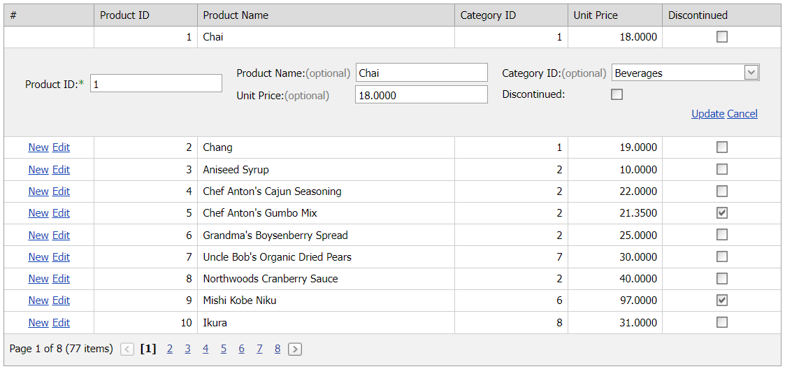

<!-- default badges list -->

[](https://supportcenter.devexpress.com/ticket/details/T285676)
[](https://docs.devexpress.com/GeneralInformation/403183)
<!-- default badges end -->
# Grid View for ASP.NET Web Forms - How to customize the edit form layout
<!-- run online -->
**[[Run Online]](https://codecentral.devexpress.com/128533294/)**
<!-- run online end -->

This example demonstrates how to use the grid's [EditFormLayoutProperties](https://docs.devexpress.com/AspNet/DevExpress.Web.ASPxGridView.EditFormLayoutProperties) property to customize the edit form layout and specify an editor's visibility based on a condition.



## Overview

Add the [Grid View](https://docs.devexpress.com/AspNet/DevExpress.Web.ASPxGridView) control to the page and specify its [EditFormLayoutProperties](https://docs.devexpress.com/AspNet/DevExpress.Web.ASPxGridView.EditFormLayoutProperties) property to access and customize the edit form layout settings. To specify a particular editor's layout, use an item's [ColumnSpan](https://docs.devexpress.com/AspNet/DevExpress.Web.LayoutItemBase.ColumnSpan) and [RowSpan](https://docs.devexpress.com/AspNet/DevExpress.Web.LayoutItemBase.RowSpan) properties.

```aspx
<dx:ASPxGridView ID="ASPxGridView1" runat="server" AutoGenerateColumns="False" DataSourceID="SqlDataSource1"
    KeyFieldName="ProductID" ... >
    <Columns>
        <!-- ... -->
    </Columns>
    <EditFormLayoutProperties ColCount="5" RequiredMarkDisplayMode="All">
        <Items>
            <dx:GridViewColumnLayoutItem ColumnName="ProductID" Name="ProductID"
                RequiredMarkDisplayMode="Required" RowSpan="2" />
            <dx:GridViewColumnLayoutItem ColumnName="ProductName"
                RequiredMarkDisplayMode="Optional" ColSpan="2" />
            <!-- ... -->
        </Items>
    </EditFormLayoutProperties>
</dx:ASPxGridView>
```

To specify an item's content, use its [Template](https://docs.devexpress.com/AspNet/DevExpress.Web.GridViewColumnLayoutItem.Template) property. In this example, the grid displays a combo box editor when a user edits the *CategoryID* column.

```aspx
<EditFormLayoutProperties ...>
    <Items>
        <!-- ... -->
        <dx:GridViewColumnLayoutItem ColumnName="CategoryID" ColSpan="2" RequiredMarkDisplayMode="Auto">
            <Template>
                <dx:ASPxComboBox ID="ASPxComboBox1" runat="server" DataSourceID="SqlDataSource2"
                    ValueType="System.Int32" Value='<%# Eval("CategoryID") %>'
                    TextField="CategoryName" ValueField="CategoryID" />
            </Template>
        </dx:GridViewColumnLayoutItem>
        <!-- ... -->
    </Items>
</EditFormLayoutProperties>
```

You can also specify a particular editor's visibility based on a condition. In this example, the grid allows a user to edit the *ProductID* column for existing rows only. For new rows, the grid hides the corresponding editor. To enable this behavior, create custom command buttons and specify the editor's visibility in the grid's server-side [CustomButtonCallback](https://docs.devexpress.com/AspNet/DevExpress.Web.ASPxGridView.CustomButtonCallback) event handler. To access the corresponding layout item, call the server-side [FindItemOrGroupByName](https://docs.devexpress.com/AspNet/DevExpress.Web.FormLayoutProperties.FindItemOrGroupByName(System.String)) method.

```aspx
<dx:GridViewCommandColumn VisibleIndex="0">
    <CustomButtons>
        <dx:GridViewCommandColumnCustomButton ID="CustomButtonNew" Text="New" />
        <dx:GridViewCommandColumnCustomButton ID="CustomButtonEdit" Text="Edit" />
    </CustomButtons>
</dx:GridViewCommandColumn>
```

```cs
private void SetEditFormLayoutItemVisibility(bool value) {
    GetEditFormLayoutItemByName(ASPxGridView1, "ProductID").Visible = value;
}
private LayoutItemBase GetEditFormLayoutItemByName(ASPxGridView grid, string name) {
    return grid.EditFormLayoutProperties.FindItemOrGroupByName(name);
}
protected void ASPxGridView1_CustomButtonCallback(object sender, ASPxGridViewCustomButtonCallbackEventArgs e) {
    if(e.ButtonID == "CustomButtonNew") {
        SetEditFormLayoutItemVisibility(false);
        ASPxGridView1.AddNewRow();
    } else {
        SetEditFormLayoutItemVisibility(true);
        ASPxGridView1.StartEdit(e.VisibleIndex);
    }
}
```

## Files to Review

* [Default.aspx](./CS/Default.aspx) (VB: [Default.aspx](./VB/Default.aspx))
* [Default.aspx.cs](./CS/Default.aspx.cs) (VB: [Default.aspx.vb](./VB/Default.aspx.vb))

## Documentation

* [Edit Form](https://docs.devexpress.com/AspNet/3680/components/grid-view/visual-elements/edit-form)

## More Examples

* [Grid View for ASP.NET Web Forms - How to hide the EditForm editor and column caption programmatically](https://github.com/DevExpress-Examples/asp-net-web-forms-grid-hide-edit-form-editor-programmatically)
